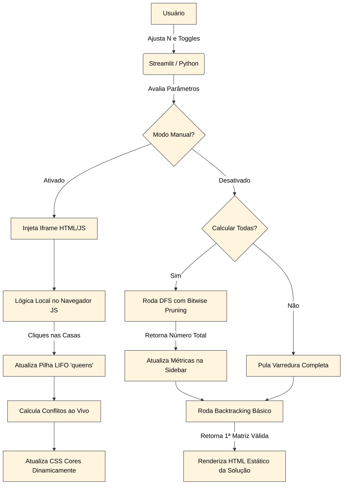

# 👑 PROBLEMA DAS N-RAINHAS

O **Problema das N-Rainhas** consiste em posicionar $N$ rainhas em um tabuleiro de xadrez de dimensões $N \times N$ de tal forma que nenhuma rainha consiga atacar outra. Pelas regras do xadrez, isso significa que **duas rainhas não podem compartilhar a mesma linha, a mesma coluna ou a mesma diagonal**. 

O problema é resolvido computacionalmente através do algoritmo de **Backtracking (Busca em Profundidade)**. 
- **Complexidade de Tempo: `O(N!)`**
- O pior caso cresce de forma fatorial. A versão completa utilizada nesta aplicação emprega a técnica de **Bitwise Pruning** (poda usando operações bit a bit) para pular milhares de galhos inúteis da árvore de busca, otimizando drasticamente a exploração. No entanto, a barreira teórica assintótica permanece `O(N!)`.

Esta aplicação foi desenvolvida para ilustrar e resolver interativamente esse desafio.

- **Aplicação desenvolvida:** 
<p align="center" width="240">
  
</p>

- **Link da aplicação web:** https://ia-problemanrainhas.streamlit.app/

---

## 📂 ORGANIZAÇÃO DO PROJETO

O projeto está estruturado da seguinte forma para separar lógica de backend, frontend injetado e configurações de ambiente:

```text
📁 Raiz do Projeto
├── 📄 main.py                 # Motor central: Interface Streamlit, algoritmos Backtracking e DFS Avançado.
├── 📄 README.md               # Documentação técnica e arquitetural da aplicação.
├── 📄 .gitignore              # Regras de exclusão de artefatos para o repositório Git.
├── 📄 requirements.txt        # Mapeamento de dependências Python (ex.: streamlit).
├── 📁 .devcontainer         
│   └── 📄 devcontainer.json   # Configuração de contêineres para padronização do ambiente (Codespaces/Docker).
├── 📁 .streamlit            
│   └── 📄 config.toml         # Sobrescrita visual nativa (Força o tema escuro e a cor primária #3977ff).
└── 📁 assets                  # Imagens, GIFs e PDFs (Registro de Prompts) utilizados na documentação.
    ├── 🖼️ CompleteExample.gif
    ├── 📄 Registro de Prompts.pdf
    ├── 🖼️ TelaCompletaTamanho12.png
    ├── 🖼️ TelaInicial.png
    └── 🖼️ TelaModoManual.png
```

---

## 🏗️ ARQUITETURA PROPOSTA

A aplicação utiliza uma **arquitetura híbrida** para contornar as limitações de recarregamento do Streamlit, dividindo responsabilidades entre o servidor e o cliente. 

### Principais Componentes
- **Backend e Interface Base (Python/Streamlit):** O Streamlit atua como o motor central. Ele gerencia a interface, recebe os parâmetros do usuário ($N$) e possui duas rotas de execução para o algoritmo automático:
  - **Busca Rápida (Gabarito Visual):** Executa o algoritmo de *Backtracking* tradicional apenas até encontrar a primeira solução válida, permitindo a renderização instantânea do tabuleiro.
  - **Varredura Completa (Toggle "Calcular Todas"):** Se ativado, aciona o algoritmo DFS utilizando *Bitwise Pruning* (operações lógicas bit a bit). Ele explora toda a árvore de estado para contar o número exato de soluções seguras e atualizar as métricas na barra lateral.
- **Frontend Interativo (HTML/CSS/JS):** Para o *Modo Manual*, a aplicação suspende os algoritmos em Python e injeta um componente web isolado via *iframe* (`components.html`). Isso transfere toda a lógica de interação (cliques e validação) para o navegador do usuário, sem necessidade de comunicação constante com o servidor.

### Representação do Tabuleiro e Rainhas
- **O Tabuleiro:** É renderizado de forma responsiva através de CSS (`display: grid`), dispensando a criação de matrizes complexas na memória para o aspecto visual.
- **As Rainhas:** No modo interativo (JS), são armazenadas em um *array* de objetos (`queens`), guardando somente as coordenadas de linha e coluna (`{r, c}`). Esse array funciona como uma **Pilha (LIFO)**. Ao clicar em "Desfazer", o sistema aplica um `queens.pop()`, removendo a última jogada.

### Verificação de Conflitos
No modo manual, a checagem matemática ocorre instantaneamente no lado do cliente:
- **Linhas e Colunas:** Verifica-se se rainhas distintas compartilham a mesma linha (`q1.r === q2.r`) ou coluna (`q1.c === q2.c`).
- **Diagonais:** Confere-se se a diferença absoluta entre as linhas é igual à diferença absoluta entre as colunas (`Math.abs(q1.r - q2.r) === Math.abs(q1.c - q2.c)`).
- **Feedback Visual:** As células sob ameaça recebem dinamicamente a classe CSS `.conflict`, colorindo as casas de vermelho.

### Diagrama Simplificado

---

## 📸 IMAGENS

- **Tela inicial com $N=8$:**
<p align="center" width="240">
  
</p>

- **Modo automático com $N=12$:**
<p align="center" width="240">
  
</p>

- **Modo manual com $N=6$:**
<p align="center" width="240">
  
</p>

---

## 🚀 INSTALAÇÃO E EXECUÇÃO LOCAL

### 1. Clone o repositório
```bash
git clone https://github.com/LuanVitorCD/IA_ProblemaNRainhas.git
cd IA_ProblemaNRainhas
```

### 2. Crie o seu ambiente virtual Python
```bash
python -m venv venv
```

### 3. Ative o ambiente virtual
```bash
# Windows
venv\Scripts\activate
# Linux/Mac
source venv/bin/activate
```

### 4. Instale todas as bibliotecas Python que serão usadas
```bash
pip install -r requirements.txt
```

### 5. Rode o código Streamlit
```bash
streamlit run main.py
```

### 6. Acesse no seu navegador
```
http://localhost:8501/
```

Aproveite! 🎉
