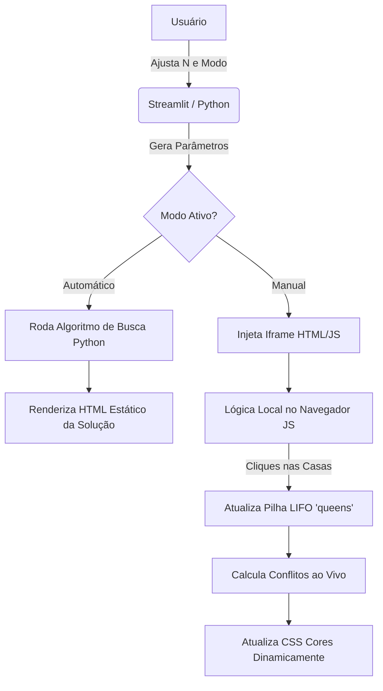
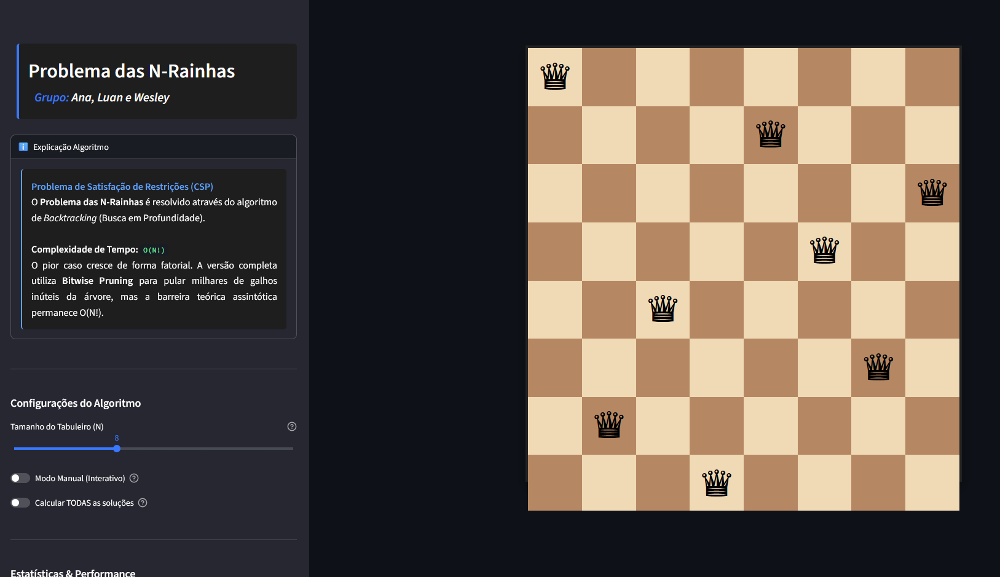
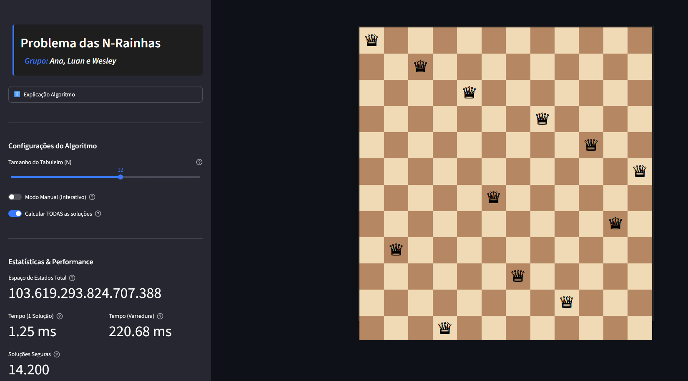
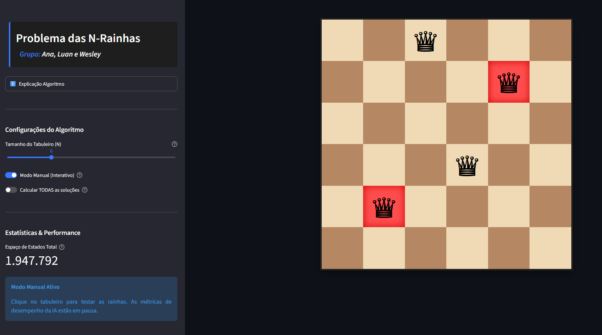

# 👑 PROBLEMA DAS N-RAINHAS

O **Problema das N-rainhas** consiste em posicionar $N$ rainhas em um tabuleiro de xadrez de dimensões $N \times N$ de tal forma que nenhuma rainha consiga atacar outra. Pelas regras do xadrez, isso significa que **duas rainhas não podem compartilhar a mesma linha, a mesma coluna ou a mesma diagonal**. 

O problema é resolvido computacionalmente através do algoritmo de **Backtracking (Busca em Profundidade)**. 
- **Complexidade de Tempo: `O(N!)`**
- O pior caso cresce de forma fatorial. A versão completa utilizada nesta aplicação emprega a técnica de **Bitwise Pruning** (poda usando operações bit a bit) para pular milhares de galhos inúteis da árvore de busca, otimizando drasticamente a exploração. No entanto, a barreira teórica assintótica permanece `O(N!)`.

Esta aplicação foi desenvolvida para ilustrar e resolver interativamente esse desafio.

- **Aplicação desenvolvida:** 
<p align="center" width="240">
  
</p>

- **Link para testar:** https://ia-problemanrainhas.streamlit.app/

---

## 📂 ORGANIZAÇÃO DO PROJETO

O projeto está estruturado da seguinte forma para separar configurações, código-fonte e recursos visuais:

```text
📁 Raiz do Projeto
├── 📄 main.py               # Código principal (Interface Streamlit e Algoritmos de Busca em Python)
├── 📄 README.md             # Documentação do projeto
├── 📄 .gitignore            # Arquivos ignorados pelo controle de versão (Git)
├── 📄 requirements.txt      # Bibliotecas e dependências necessárias
├── 📁 .devcontainer         
│   └── 📄 devcontainer.json # Configuração de ambiente conteinerizado (Docker/Codespaces)
├── 📁 .streamlit            
│   └── 📄 config.toml       # Configurações de tema e comportamento da interface do Streamlit
└── 📁 assets                # Recursos estáticos
    ├── 🖼️ CompleteExample.gif
    ├── 📄 Registro de Prompts.pdf
    ├── 🖼️ TelaCompletaTamanho12.png
    ├── 🖼️ TelaInicial.png
    └── 🖼️ TelaModoManual.png
```

---

## 🏗️ ARQUITETURA PROPOSTA

A aplicação utiliza uma **arquitetura híbrida** para contornar as limitações do framework padrão do Streamlit (que recarrega a página a cada interação) e garantir uma experiência fluida para o usuário. 

### Principais Componentes
- **Backend e Interface Base (Python/Streamlit):** O Streamlit atua como o motor central. Ele gerencia a barra lateral, recebe o tamanho ($N$) do tabuleiro e executa os algoritmos pesados de busca no servidor (Backtracking para encontrar uma solução rápida e DFS com *Bitwise Pruning* para contar o total de soluções).
- **Frontend Interativo (HTML/CSS/JS):** Para o *Modo Manual*, injetamos um componente web isolado via *iframe* (`components.html`). Isso transfere a interação (inserção, remoção e validação visual de conflitos) para o navegador do cliente, ocorrendo instantaneamente sem recarregar o servidor.

### Representação do Tabuleiro e Rainhas
- **O Tabuleiro:** É renderizado de forma responsiva através de CSS (`display: grid`), dispensando a criação de matrizes complexas na memória apenas para o aspecto visual.
- **As Rainhas:** No modo interativo (JS), são armazenadas em um *array* de objetos (`queens`), guardando somente as coordenadas de linha e coluna (`{r, c}`). Esse array funciona como uma **Pilha (LIFO)**. Ao clicar em "Desfazer", o sistema aplica um `queens.pop()`, removendo a última rainha inserida.

### Verificação de Conflitos
A checagem matemática ocorre em tempo real, varrendo todos os pares de rainhas alocadas:
1. **Linha e Coluna:** Verifica-se se compartilham a mesma linha (`q1.r === q2.r`) ou a mesma coluna (`q1.c === q2.c`).
2. **Diagonais:** Confere-se se a diferença absoluta entre as linhas é igual à diferença absoluta entre as colunas (`Math.abs(q1.r - q2.r) === Math.abs(q1.c - q2.c)`).
3. **Feedback Visual:** Quando um conflito é detectado, a interface atualiza dinamicamente, adicionando a classe CSS `.conflict` para colorir as casas ameaçadas de vermelho.

### Diagrama Simplificado


---

## 📸 IMAGENS

- **Tela inicial com $N=8$:**
<p align="center" width="240">
  
</p>

- **Modo automático com $N=12$:**
<p align="center" width="240">
  
</p>

- **Modo manual com $N=6$:**
<p align="center" width="240">
  
</p>

---

## 🚀 INSTALAÇÃO E EXECUÇÃO

### Pré-requisitos:
1. Crie o seu ambiente virtual Python
```bash
python -m venv venv
```

2. Ative o ambiente virtual
```bash
# Windows
venv\Scripts\activate
# Linux/Mac
source venv/bin/activate
```

3. Instale todas as bibliotecas Python que serão usadas
```bash
pip install -r requirements.txt
```

### Executando localmente:
1. Rode o código Streamlit
```bash
streamlit run main.py
```
2. Acesse no seu navegador
```text
http://localhost:8501/
```

Aproveite! 🎉
